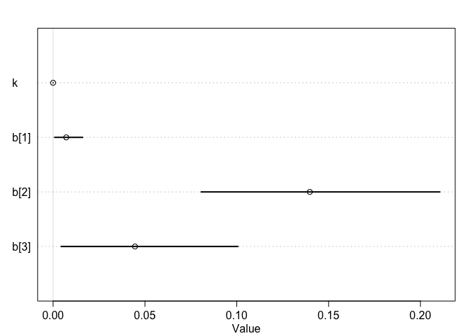
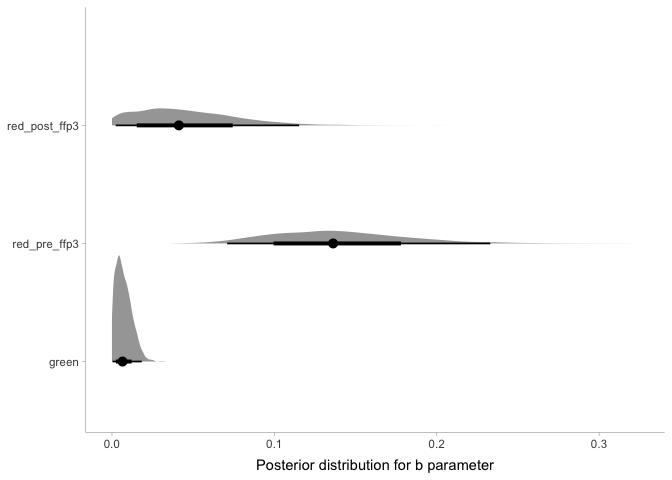

README
================
Lars Mølgaard Saxhaug
6/29/2021

## Bayesian reanalysis on the basis of [“FFP3 respirators protect healthcare workers against infection with SARS-CoV-2”](https://authorea.com/users/421653/articles/527590-ffp3-respirators-protect-healthcare-workers-against-infection-with-sars-cov-2)

``` r
df <- tibble::tribble(
  ~Week, ~Week.start, ~Red.cases, ~Red.ward.days, ~Red.cases.per.ward.day, ~Green.cases, ~Green.ward.days, ~Green.cases.per.ward.day, ~Excluded.cases, ~Total, ~Community,
  1L, "02/11/2020", 0L, 7L, 0, 5L, 245L, 0.02, 16L, 21L, 7876L,
  2L, "09/11/2020", 2L, 7L, 0.286, 7L, 245L, 0.028, 33L, 42L, 9499L,
  3L, "16/11/2020", 1L, 12L, 0.083, 3L, 240L, 0.013, 26L, 30L, 7998L,
  4L, "23/11/2020", 1L, 14L, 0.071, 6L, 238L, 0.025, 24L, 31L, 7203L,
  5L, "30/11/2020", 3L, 14L, 0.214, 6L, 238L, 0.025, 20L, 29L, 9441L,
  6L, "07/12/2020", 5L, 14L, 0.357, 10L, 238L, 0.042, 33L, 48L, 16535L,
  7L, "14/12/2020", 1L, 14L, 0.071, 7L, 238L, 0.029, 41L, 49L, 31219L,
  8L, "21/12/2020", 3L, 14L, 0.214, 10L, 238L, 0.042, 56L, 69L, 37259L,
  9L, "28/12/2020", 2L, 21L, 0.095, 20L, 231L, 0.087, 58L, 80L, 50110L,
  10L, "04/01/2021", 4L, 29L, 0.138, 34L, 223L, 0.152, 70L, 108L, 41663L,
  11L, "11/01/2021", 5L, 50L, 0.1, 34L, 202L, 0.168, 63L, 102L, 31341L
) %>%
  rename_with(to_snake_case) %>%
  mutate(week_start = as_date(parse_date_time(week_start, orders = "dmy"))) 
```

    ## rename_with: renamed 11 variables (week, week_start, red_cases, red_ward_days, red_cases_per_ward_day, …)

    ## mutate: converted 'week_start' from character to Date (0 new NA)

``` r
# pivot longer, create stan compatible data
df_mod <- df %>%
  pivot_longer(starts_with("red") | starts_with("green"), names_to = c("ward", "variable"), names_pattern = "(\\w[^_]*)_?(.*)") %>%
  mutate(across(where(is.character), as.factor),
         community=as.numeric(community)) %>%
  pivot_wider(values_from = value, names_from = variable) %>%
  mutate(fp=as.integer(ifelse(ward=="green",1,ifelse(week<9,2,3)))) %>% select(cases,community,fp,ward_days) %>% 
  as.list()
```

    ## pivot_longer: reorganized (red_cases, red_ward_days, red_cases_per_ward_day, green_cases, green_ward_days, …) into (ward, variable, value) [was 11x11, now 66x8]

    ## mutate: converted 'community' from integer to double (0 new NA)

    ##         converted 'ward' from character to factor (0 new NA)

    ##         converted 'variable' from character to factor (0 new NA)

    ## pivot_wider: reorganized (variable, value) into (cases, ward_days, cases_per_ward_day) [was 66x8, now 22x9]

    ## mutate: new variable 'fp' (integer) with 3 unique values and 0% NA

    ## select: dropped 6 variables (week, week_start, excluded_cases, total, ward, …)

#### Model sampling

k: constant for community derived infections

b: corresponding to g, r1 and r2 parameters in original paper, parameter
for ward derived infections

``` r
# using rethinking package to compose and sample stan model
# priors are very uninformative
m1 <- ulam(alist(
  cases ~ dpois(lambda), # poisson likelihood
  lambda <- (k * community + b[fp]) * ward_days,
  k ~ dexp(1),
  b[fp] ~ dexp(1)
), data = df_mod, chains = 4, iter = 2000, cores = 4, file = here("fits", "m1"))
precis(m1, depth = 2)
```

    ##              mean           sd         5.5%        94.5%    n_eff    Rhat4
    ## k    2.163690e-06 2.811082e-07 1.701046e-06 2.608647e-06 1622.242 1.003194
    ## b[1] 7.159328e-03 4.873768e-03 8.483119e-04 1.610184e-02 1299.317 1.002379
    ## b[2] 1.397804e-01 4.119078e-02 8.059234e-02 2.105205e-01 2730.236 1.001109
    ## b[3] 4.458243e-02 3.157221e-02 4.395731e-03 1.006397e-01 2021.395 1.001550

``` r
plot(m1, depth = 2)
```

<!-- -->

``` r
stancode(m1)
```

    ## data{
    ##     int cases[22];
    ##     int ward_days[22];
    ##     int fp[22];
    ##     int community[22];
    ## }
    ## parameters{
    ##     real<lower=0> k;
    ##     vector<lower=0>[3] b;
    ## }
    ## model{
    ##     vector[22] lambda;
    ##     b ~ exponential( 1 );
    ##     k ~ exponential( 1 );
    ##     for ( i in 1:22 ) {
    ##         lambda[i] = (k * community[i] + b[fp[i]]) * ward_days[i];
    ##     }
    ##     cases ~ poisson( lambda );
    ## }

#### Stancode:

``` r
rethinking::stancode(m1)
```

    ## data{
    ##     int cases[22];
    ##     int ward_days[22];
    ##     int fp[22];
    ##     int community[22];
    ## }
    ## parameters{
    ##     real<lower=0> k;
    ##     vector<lower=0>[3] b;
    ## }
    ## model{
    ##     vector[22] lambda;
    ##     b ~ exponential( 1 );
    ##     k ~ exponential( 1 );
    ##     for ( i in 1:22 ) {
    ##         lambda[i] = (k * community[i] + b[fp[i]]) * ward_days[i];
    ##     }
    ##     cases ~ poisson( lambda );
    ## }

#### Mean and credible intervals corresponding to table 2 in the paper

``` r
m1 %>%
  gather_draws(k, b[fp]) %>%
  mutate(fp = factor(fp, levels = 1:4, labels = c("green", "red_pre_ffp3", "red_post_ffp3", "na"))) %>%
  mean_hdi(.value) %>%
  mutate(parameter = ifelse(.variable == "b", paste(.variable, fp, sep = "_"), .variable)) %>%
  ungroup() %>%
  select(parameter, .value, .lower, .upper) %>%
  mutate(parameter = as.character(parameter)) %>%
  bind_rows(., m1 %>%
    spread_draws(k, b[fp]) %>%
    mutate(fp = factor(fp, levels = 1:3, labels = c("b_green", "b_red_pre_ffp3", "b_red_post_ffp3"))) %>%
    compare_levels(b, by = fp, fun = `/`) %>%
    mean_hdci() %>%
    select(fp, b, .lower, .upper) %>%
    rename("parameter" = fp, ".value" = b)) %>%
  mutate(parameter = factor(parameter, levels = c(
    "k", "b_green", "b_red_pre_ffp3", "b_red_post_ffp3", "b_red_post_ffp3 / b_red_pre_ffp3", "b_red_pre_ffp3 / b_green",
    "b_red_post_ffp3 / b_green"
  ))) %>%
  arrange(parameter) %>%
  knitr::kable(col.names = c("Model parameter", "Posterior mean", "Lower bound 95% cred. int.", "Upper bound 95% cred. int"))
```

| Model parameter                        | Posterior mean | Lower bound 95% cred. int. | Upper bound 95% cred. int |
|:---------------------------------------|---------------:|---------------------------:|--------------------------:|
| k                                      |      0.0000022 |                  0.0000016 |                 0.0000027 |
| b\_green                               |      0.0071593 |                  0.0000150 |                 0.0164193 |
| b\_red\_pre\_ffp3                      |      0.1397804 |                  0.0684703 |                 0.2248190 |
| b\_red\_post\_ffp3                     |      0.0445824 |                  0.0000371 |                 0.1026371 |
| b\_red\_post\_ffp3 / b\_red\_pre\_ffp3 |      0.3449485 |                  0.0002922 |                 0.8666339 |
| b\_red\_pre\_ffp3 / b\_green           |     68.4749708 |                  3.1388856 |               174.3314466 |
| b\_red\_post\_ffp3 / b\_green          |     19.4586523 |                  0.0136258 |                49.6233662 |

#### Posterior distributions for ward driven infection risk

``` r
m1 %>% 
  spread_draws(k,b[fp]) %>% 
  mutate(fp=factor(fp,levels = 1:3,labels = c("green","red_pre_ffp3","red_post_ffp3"))) %>%
  ggplot(aes(x=b,y=fp))+
  stat_halfeye() +
  scale_x_continuous(name = "Posterior distribution for b parameter")+
  scale_y_discrete(name = NULL)
```

    ## mutate (grouped): converted 'fp' from integer to factor (0 new NA)

<!-- -->
